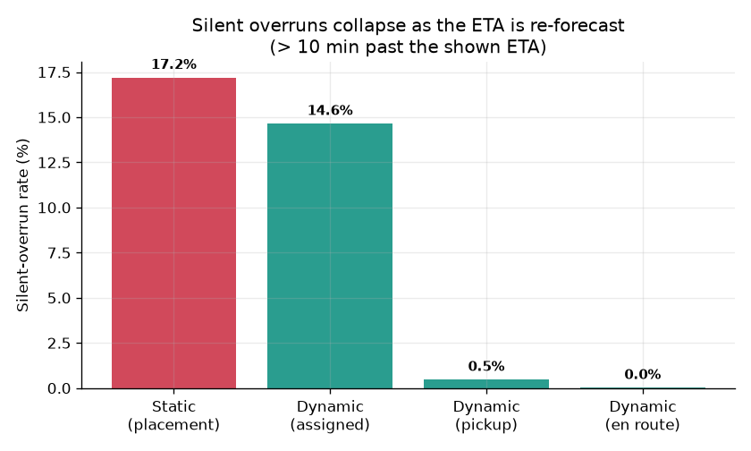
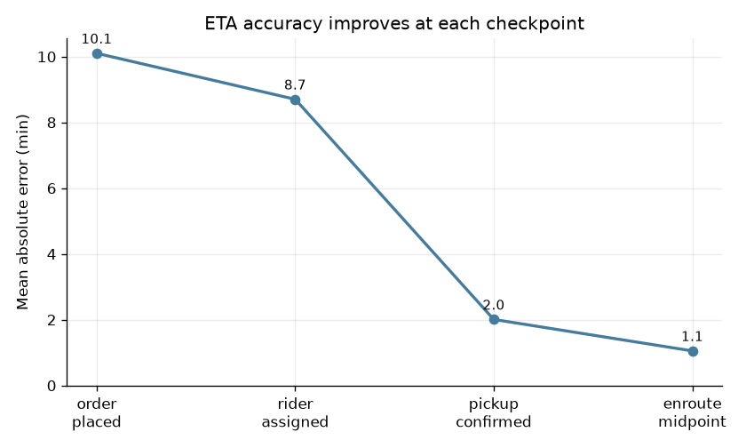
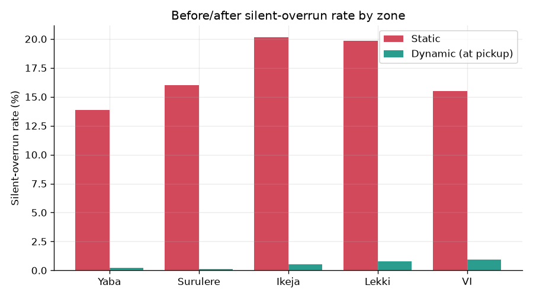
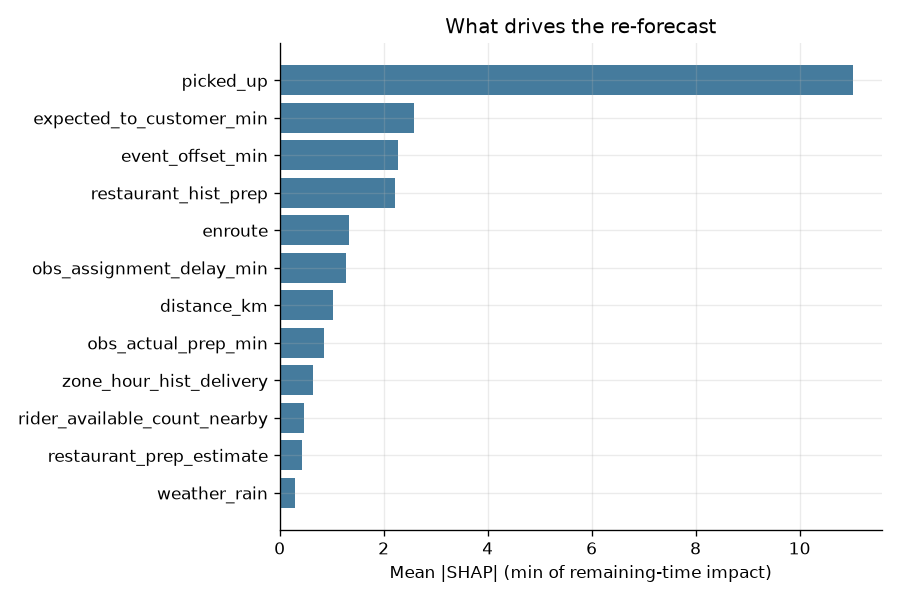
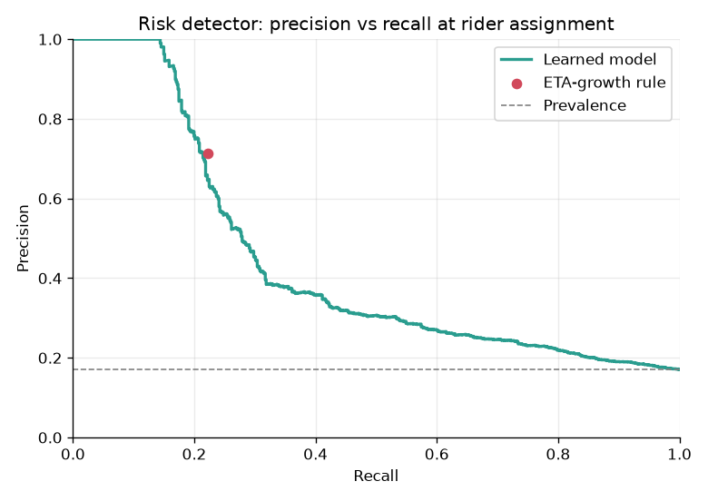

# chow-eta-reforecast

**Dynamic ETA re-forecasting for last-mile delivery** — a synthetic-data proof of concept.

> ⚠️ Built entirely on **synthetic data**. This is a proof of concept exploring an approach to a
> problem, not a claim about any real company's production system.

Most delivery ETAs are predicted **once**, at order placement, and never revised. When real delays
accumulate — a late rider assignment, a restaurant prep overrun, traffic — the customer-facing ETA
goes stale silently. People tolerate delays far better than they tolerate *silent, unexplained*
ones, so a stale ETA is a trust problem, not just a latency problem.

This project treats ETA as a **live, event-driven quantity**:

1. **Re-forecast** the ETA at every lifecycle checkpoint
   (order placed → rider assigned → pickup confirmed → en-route midpoint), each prediction
   conditioned only on what is observable at that moment.
2. **Flag silent-overrun risk** early — at rider assignment — so the system can proactively notify
   the customer with a revised ETA *before* they are left wondering.

---

## Results

All figures below come from a held-out test set on the synthetic data. Regenerate everything with
`python -m src.pipeline`.

### Silent overruns collapse as the ETA is re-forecast

The static baseline quotes one ETA at placement and never updates it. It is essentially unbiased on
average, yet **17.2%** of orders still finish more than 10 minutes past that promise — silently. The
dynamic model, given the *same* information at placement, performs identically there (MAE 10.0 vs
10.1 min), then sharpens at each checkpoint as real signals arrive.



| Stage | MAE (min) | Silent-overrun rate |
| --- | --- | --- |
| Static (placement, never revised) | 10.0 | 17.2% |
| Dynamic — order placed | 10.1 | 17.0% |
| Dynamic — rider assigned | 8.7 | 14.6% |
| Dynamic — pickup confirmed | 2.0 | **0.5%** |
| Dynamic — en-route midpoint | 1.1 | 0.0% |

The key result is not just accuracy but the **97% relative reduction in silent overruns** by pickup.
Because the placement-checkpoint numbers match the baseline, that gain comes from *fresher
information*, not a more powerful model.



### The worst orders benefit most

Broken down by segment, the orders that produce the worst experiences — compounding delays that lead
to hour-plus waits — are exactly where a static ETA fails most and re-forecasting helps most:

| Segment | Static | Dynamic (at pickup) |
| --- | --- | --- |
| All orders | 17.2% | 0.5% |
| Peak hours | 18.4% | 0.4% |
| **Compounding delays** | **25.1%** | **0.4%** |



### What drives the re-forecast

SHAP attributions on the re-forecaster are intuitive: the dominant signal is whether the order has
been **picked up** (after which the remaining time is mostly travel), followed by the distance-based
travel prior, elapsed time, and the restaurant's historical prep time.



### Risk detector: catching silent overruns early

At rider assignment — the earliest moment the realised assignment delay is known — a classifier
predicts whether an order is heading for a silent overrun (prevalence 17%, PR-AUC 0.44). It is
compared honestly against a hand-tuned rule that flags on how much the ETA has already grown:

| Operating point | Precision | Recall | Orders flagged |
| --- | --- | --- | --- |
| Learned model (F1-optimal) | 38% | 34% | 15% |
| Learned model (matched to rule's budget) | 70% | 22% | 5% |
| ETA-growth rule | 71% | 22% | 5% |

At an equal notification budget the learned model **matches** the rule; unlike the fixed rule, it
exposes the whole precision/recall curve, so the operating point can be tuned to catch more overruns
early when that trade-off is worth it. Whatever it misses at assignment is still caught at pickup by
the re-forecaster.



A flagged order yields a ready-to-send message, e.g. *"Your order is running later than expected.
Updated ETA: about 105 minutes."*

---

## Architecture

```text
Synthetic data engine        simulate/orders.py
        │                     realistic orders: Lagos zones, meal peaks, rain, rider scarcity
Lifecycle + delay dynamics    simulate/lifecycle.py
        │                     prep overruns, heavy-tailed assignment, congestion-aware travel
Feature pipeline              features/pipeline.py
        │                     leakage-safe, per-checkpoint features (fit/transform)
ETA models                    models/baseline.py (static)  ·  models/dynamic.py (re-forecast)
        │
Risk detector                 risk/detector.py
        │                     flags silent overruns at rider assignment
Serving API                   api/main.py   (/predict_eta, /reforecast, /risk_check, /health)
        │
Monitoring                    dashboard/app.py  ·  monitoring/drift.py (Evidently)
```

## Monitoring and drift

`monitoring/drift.py` simulates a regime shift — a wetter, more congested "rainy season" — and uses
Evidently to detect it. The production model, trained on the normal regime, degrades under the shift
(silent-overrun rate **17.9% → 22.2%**) while Evidently flags **25%** of monitored columns as
drifted. This is the signal a monitoring system would use to trigger retraining before customers
feel it.

The Streamlit dashboard presents the whole before/after story interactively, including a live feed of
orders currently flagged for a proactive notification.

---

## Quickstart

```bash
python -m venv .venv && source .venv/bin/activate   # Windows: .venv\Scripts\activate
pip install -r requirements.txt

# Run the full pipeline: data -> models -> reports -> serving bundle
python -m src.pipeline

# Serve the API (http://localhost:8000/docs)
uvicorn api.main:app --reload

# Run the dashboard (http://localhost:8501)
streamlit run dashboard/app.py
```

Docker:

```bash
docker build -t chow-eta-reforecast .
docker run -p 8000:8000 chow-eta-reforecast
```

## Project structure

```text
src/
  simulate/    synthetic order + lifecycle generation
  features/    leakage-safe per-checkpoint feature pipeline
  models/      static baseline, dynamic re-forecaster, comparison + SHAP
  risk/        silent-overrun risk detector
  serving/     inference service + persisted serving bundle
  monitoring/  Evidently drift scenario
  pipeline.py  end-to-end runner
api/           FastAPI serving layer
dashboard/     Streamlit monitoring dashboard
tests/         pytest suite (simulation, no-leakage, models, API)
```

## From proof of concept to production

Taking this beyond synthetic data would need, from the real platform:

- an **order-event stream** (placement, assignment, pickup, delivery) to drive the checkpoints,
- **rider GPS pings** at a known cadence for en-route re-forecasting,
- **per-restaurant prep telemetry** to replace the simulated prep model, and
- experiment infrastructure to measure the actual effect of proactive notifications on customer trust
  and retention.

## Tech stack

Python · pandas · NumPy · XGBoost · scikit-learn · SHAP · FastAPI · Evidently · Streamlit · Docker.

## License

MIT — see [LICENSE](LICENSE).
